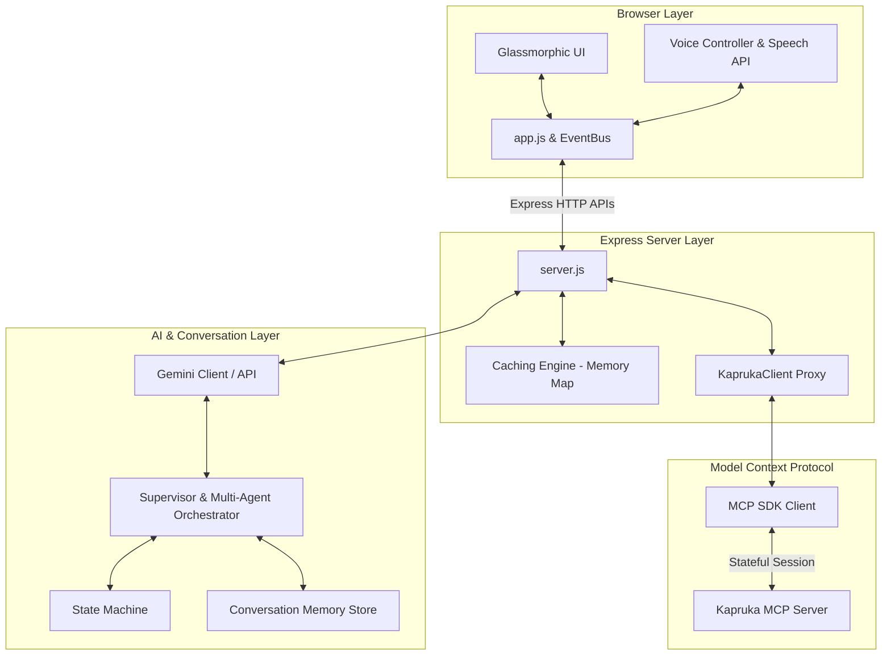

# 🌸 Nelum AI

[](https://developer.mozilla.org/en-US/docs/Web/JavaScript)
[](https://nodejs.org/)
[](https://expressjs.com/)
[](https://deepmind.google/technologies/gemini/)
[](https://modelcontextprotocol.io/)
[](https://github.com/SethikaMoraes/Kapruka-AIChatbot-Nelum)
[](#key-features)
[](LICENSE)

> **Sri Lanka's AI Shopping Companion powered by Conversational Commerce.**

Nelum AI is a next-generation conversational shopping companion built specifically for the **Kapruka MCP Challenge**. It replaces traditional, static e-commerce catalog grids with an immersive, full-screen conversational interface that understands users' intents, preferences, and emotions. By integrating directly with the **Kapruka Model Context Protocol (MCP) Server** via the official SDK, Nelum AI supports real-time product discovery, shipping checks, and seamless checkout, making e-commerce feel personal, localized, and human.

---

## 📸 Screenshots / Demo

### 1. Landing Page

*A premium full-screen interface welcoming the customer with a conversational input box, voice activation buttons, and initial icebreaker prompts.*

### 2. Conversation Experience

*Empathetic, contextual interactions showing multi-turn memory, custom recommendations, and relationship detection.*

### 3. Product Discovery

*Live Kapruka catalog items loaded into interactive glassmorphic cards, featuring dynamic product badges and delivery estimate cues.*

### 4. Checkout Flow

*End-to-end guest checkout sequence with inline recipient details forms, real-time city shipping checks, and payment gateway navigation.*

### 5. Voice Experience

*Interactive voice companion panel showing active soundwave visualizer animations and voice configuration settings.*

---

## 🌟 Key Features

| Category | Feature Name | Description |
| :--- | :--- | :--- |
| **Conversational Commerce** | Natural Shopping Conversations | Engaging dialog flow driven by Gemini, avoiding rigid command trees. |
| | Multi-Turn Memory | Holds context across multiple rounds of dialogue to narrow down choices. |
| | Clarification Engine | Proactively asks clarifying questions when queries are ambiguous (e.g. budget, age). |
| | Friendly Sri Lankan Personality | Adapts tone to include warmth, politeness, and local custom greetings ("Ayubowan", "Machan"). |
| **AI & Agent Architecture** | Multi-Agent Orchestration | Supervisor agent splits complex tasks and delegates to specialized workers. |
| | Recommendation Agent | Identifies upselling and bundled gift items to maximize order value. |
| | Delivery Agent | Verifies distance and delivery rates using live city indices. |
| | Checkout & Tracking Agents | Automates the order preparation and shipping tracking milestone maps. |
| **Localization** | Multi-lingual Support | Full Sinhala and Tamil natural language understanding. |
| | Singlish & Tanglish Parsers | Handles colloquial language mixing (English-Sinhala/Tamil phonetics). |
| | Cultural Intelligence Engine | Matches Sri Lankan holidays, occasions, and gift giving traditions (e.g. Avurudu, Wesak). |
| **Commerce Features** | Live Kapruka Search | Direct, zero-latency catalog lookup using proxy endpoint. |
| | Delivery Feasibility Checks | Validates city names and checks shipping feasibility for perishable items. |
| | Complete Guest Checkout | Fully automated order booking, producing direct checkout URLs. |
| **Voice Experience** | Hands-free Voice Companion | Voice commands and responses powered by Web Speech API. |
| | Gemini-Powered TTS | High-fidelity voice synthesis with fallback to native browser voices. |
| | Intelligent Voice Interruption | Stop the assistant speaking simply by talking over it. |

---

## 🏗️ Architecture Overview

The system uses a stateful, modular multi-agent architecture where Express handles CORS and serves as a secure proxy to the official Model Context Protocol transport client.



---

## 📁 Project Structure

Below is the directory tree mapping showing the modular layout of the application:

```text
nelum-ai/
├── .env.example                       # Template for local environment variables
├── .gitignore                         # Standard project git exclusions
├── app.js                             # Frontend application entry point and UI controller
├── index.html                         # Full-screen conversational UI layout
├── server.js                          # Express proxy server and official MCP client connection
├── styles.css                         # CSS design system (glassmorphism, animations)
├── package.json                       # Node dependencies and scripts
└── src/
    ├── agents/                        # Multi-agent worker files
    │   ├── agentOrchestrator.js       # Orchestrates and transfers context between agents
    │   ├── supervisorAgent.js         # The master planner routing user tasks
    │   ├── productAgent.js            # Product query & discovery agent
    │   ├── recommendationAgent.js     # Up-selling and gifting advisor
    │   ├── deliveryAgent.js           # Shipping rate and city validation agent
    │   ├── checkoutAgent.js           # Coordinates recipient details and orders
    │   └── trackingAgent.js           # Order status and courier tracking agent
    ├── ai/
    │   └── geminiClient.js            # Integrates Google Gemini API for responses and analysis
    ├── commerce/
    │   ├── cartEngine.js              # Business logic for active shopping cart
    │   ├── checkoutEngine.js          # Prepares final checkout payloads
    │   └── deliveryEngine.js          # Handles delivery logic and rules
    ├── conversation/                  # Empathy and conversation engines
    │   ├── clarificationEngine.js     # Identifies ambiguous requests
    │   ├── conversationMemory.js      # Session-based conversational memory
    │   ├── emotionDetector.js         # Tracks user emotions (happy, sad, frustrated)
    │   ├── empathyEngine.js           # Alters responses to match customer feelings
    │   ├── positivityEngine.js        # Infuses positive, reassuring vocabulary
    │   ├── smallTalkEngine.js         # Chat engine for casual non-shopping dialogue
    │   └── responseComposer.js        # Combines agent insights into clean HTML outputs
    ├── localization/                  # Multilingual parsing scripts
    │   ├── languageProcessor.js       # Language detector (Sinhala, Tamil, English)
    │   └── singlishParser.js          # Resolves Singlish input phonetics
    ├── mcp/
    │   └── kaprukaClient.js           # Proxy consumer class communicating with Express backend
    ├── memory/
    │   ├── memoryStore.js             # LocalStorage memory interface
    │   └── preferenceEngine.js        # Captures liked brands and budget categories
    ├── recommendations/
    │   ├── bundleEngine.js            # Gift bundle recommendations
    │   └── recommendationEngine.js    # Standard recommendations
    ├── runtime/
    │   ├── conversationManager.js     # Orchestrates logic flow per message turn
    │   └── stateMachine.js            # Defines states (Discovery, Checkout, etc.)
    └── voice/                         # Complete custom Voice engine
        ├── voiceController.js         # Connects speech APIs with UI controllers
        ├── speechRecognitionEngine.js  # Voice-to-text with multi-language setups
        ├── speechSynthesisEngine.js   # High-quality text-to-speech outputs
        └── interruptionManager.js     # Manages immediate voice-stopping capabilities
```

---

## 🛠️ Technology Stack

| Component | Technology | Description |
| :--- | :--- | :--- |
| **Frontend UI** | HTML5, Vanilla CSS3, JavaScript | Highly responsive glassmorphic design featuring custom soundwave visualizers and responsive layouts. |
| **Backend API** | Node.js, Express | Backend routing server resolving CORS policies and proxying stateful MCP traffic. |
| **Core AI** | Google Gemini API | Powers the main supervisor orchestrator, natural language generation, and dialogue metrics. |
| **Commerce Connection**| Model Context Protocol (MCP) | Connection to the live Kapruka MCP Server using the official `@modelcontextprotocol/sdk`. |
| **Voice Engine** | Web Speech API + Gemini TTS | Combines native speech recognition with high-fidelity speech synthesis fallback capabilities. |
| **Storage Layer** | LocalStorage + Memory Store | Fast, client-side persistence of customer shopping preferences, carts, and conversational states. |

---

## 🚀 Installation & Setup

Adhere to the steps below to set up Nelum AI locally:

### Prerequisites
*   Node.js (v18 or higher)
*   NPM (v9 or higher)
*   A Gemini API Key (obtain from Google AI Studio)

### Steps

1.  **Clone the repository**:
    ```bash
    git clone https://github.com/SethikaMoraes/Kapruka-AIChatbot-Nelum.git
    cd Kapruka-AIChatbot-Nelum
    ```

2.  **Install dependencies**:
    ```bash
    npm install
    ```

3.  **Configure environment variables**:
    Create a `.env` file in the root directory and define the following variables:
    ```ini
    PORT=8000
    NODE_ENV=development
    MCP_ENDPOINT=https://mcp.kapruka.com/mcp
    GEMINI_API_KEY=your_gemini_api_key_here
    GEMINI_VOICE_MODEL=gemini-2.0-flash
    ```

4.  **Start the proxy backend and web companion**:
    ```bash
    npm start
    ```

5.  **Open in your browser**:
    Navigate to [http://localhost:8000](http://localhost:8000) to start your shopping journey!

---

## ⚙️ Environment Variables Explained

*   `PORT`: The port number Express proxy server will run on (Default: `8000`).
*   `NODE_ENV`: Application environment state (`development` or `production`).
*   `MCP_ENDPOINT`: Stateful HTTP endpoint of the Kapruka Model Context Protocol Server.
*   `GEMINI_API_KEY`: API credential key from Google AI Studio.
*   `GEMINI_VOICE_MODEL`: Gemini model version to utilize for synthesis and intent analysis.

---

## 🛍️ Kapruka MCP Integration

Nelum AI communicates with the live Kapruka server through a suite of Model Context Protocol tools. Below are the tools implemented in the commerce backend proxy:

1.  `kapruka_search_products`: Queries the catalog database using search phrases, category limits, and price thresholds.
2.  `kapruka_get_product`: Retrieves precise product specification details (price, stock, images, weight) by product ID.
3.  `kapruka_list_categories`: Lists all available category nodes in the Kapruka database hierarchy.
4.  `kapruka_list_delivery_cities`: Matches and autocompletes delivery destinations in Sri Lanka.
5.  `kapruka_check_delivery`: Evaluates shipping feasibility, computes courier rates, and alerts if products are too fragile or perishable for the destination.
6.  `kapruka_create_order`: Commits recipient coordinates, cart item IDs, and gift messages to book the order, returning a direct Kapruka checkout payment URL.
7.  `kapruka_track_order`: Inspects shipping status milestones for ordered items.

---

## 🗣️ Voice Experience

Nelum AI features an interactive, hybrid voice companion dashboard:

*   **Hybrid Synthesis**: Combines Gemini-synthesized high-fidelity audio streams with instant browser SpeechSynthesis fallbacks for optimal reliability.
*   **Interruption Capabilities**: Real-time microphone listening is managed dynamically. If the user begins speaking while the voice assistant is reading an item, the synthesis engine stops immediately to capture input.
*   **Multi-language Recognition**: Supports switching recognition configurations to parse Tamil, Sinhala, or English speech inputs.

---

## 💬 Sample Conversations

### Empathetic Gifting Advice (English)
*   **User**: *"My mother's birthday is next week. She lives in Kandy."*
*   **Nelum**: *"Ah ❤️ That is a beautiful occasion. Celebrating mothers is always so special. Since Kandy is a bit cooler, maybe she would love a fresh flower basket or a delicious cake from Kapruka? Tell me, what kinds of things does she usually enjoy?"*
*   **User**: *"She loves chocolates and lilies."*
*   **Nelum**: *(Retrieves products via search)* *"Excellent! I found these fresh Lilies and premium chocolates. Let's make sure we check delivery feasibility to Kandy so it arrives fresh on her special day."*

### Singlish Shopping Interaction
*   **User**: *"Mata chocolate cake ekak ganna oni. Price eka 5000ta adu wenna oni."*
*   **Nelum**: *(Detects Sinhala/Singlish, filters results below LKR 5000)* *"Hari, mama oyaata LKR 5,000ta adu chocolate cakes tikak hewwa. Me cakes balanna. Oyata meken mona cake ekada oni?"*

---

## 🏆 Challenge Alignment

| Kapruka Challenge Criteria | Implemented Feature in Nelum AI |
| :--- | :--- |
| **End-to-End Shopping Flow** | Full product search, detail fetching, live cart manipulation, delivery check, and checkout URL generation. |
| **Robust Error Handling** | Fully custom error classes (NetworkError, McpError) to gracefully catch connectivity failures and inform the user. |
| **Advanced AI Capabilities** | A multi-agent structure routing tasks between supervisor, product, delivery, and tracking agents. |
| **Sri Lankan Localization** | Singlish and Tanglish phoneme parsers alongside native Sinhala and Tamil text output engines. |
| **Voice & Visual experience** | Interactive microphone control, wake word engine, voice interruption capabilities, and real-time canvas visualizers. |

---

## 🛠️ Performance & Reliability

*   **Smart Caching**: Implements a localized Map-based cache in `server.js` with defined time-to-live (TTL) bounds (e.g. 24 hours for product details, 10 minutes for searches).
*   **Parallel Resolving**: Searches return lightweight details. Nelum AI auto-resolves full details (such as high-res images) in parallel backend promises, enhancing load times.
*   **Graceful Fallbacks**: If the Kapruka MCP server goes offline, the frontend falls back to a simulated local commerce mode, allowing testing and evaluation to continue uninterrupted.

---

## 👥 Contributors

*   **Sethika Moraes** — *Creator & Lead Developer* ([GitHub Profile](https://github.com/SethikaMoraes))

---

## 📄 License

This project is licensed under the MIT License - see the [LICENSE](LICENSE) file for details.

---

## ❤️ Acknowledgements

*   **Kapruka** for hosting the MCP Challenge and providing the catalog datasets.
*   The **Google Gemini Team** for powerful LLM inference API access.
*   The **Model Context Protocol** community for pushing stateful tool integrations forward.
