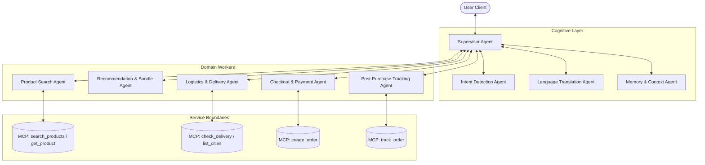
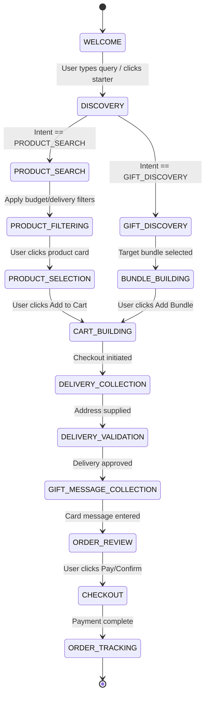

# Nelum AI Shopping Companion: Agent Architecture & Conversation State System

This document outlines the complete technical blueprint for the intelligence, coordination, and state management layer of Nelum (🌸) — an AI-powered conversational shopping companion for Kapruka. It translates user statements into semantic goals, manages context across dialogues, selects MCP tools, computes custom product recommendations, and manages the post-purchase lifecycle.

---

## 1. Agent Architecture & Message Orchestration

Nelum is built on a **Supervisor-Worker multi-agent topology**. Specialized, stateful sub-agents handle specific scopes and report back to a Supervisor Agent which maintains the global state machine and interacts directly with the chat UI.

### Agent Interactions & Orchestration flow:



### Specialized Agents Specification:

| Agent Name | Primary Responsibility | Inputs | Outputs | Escalation Path (If Unresolved) |
| :--- | :--- | :--- | :--- | :--- |
| **Supervisor** | Main coordinator; manages the global state machine, schedules task delegation, handles context merges. | User query string, last state frame, worker agent summaries. | Next state flag, client-bound text response, UI action commands. | Fallback to professional human agent. |
| **Intent** | Classifies incoming query strings into intent taxonomy, scores confidence thresholds. | Raw text string, historical conversation turns. | Intent label, confidence float (0.0 - 1.0), raw entities. | Delegate to Supervisor for clarifying query. |
| **Language** | Detects code-switching (Singlish, Tanglish); normalizes inputs to canonical format. | Raw text input, active user language history. | English translated representation, language tags. | Standardize to English default. |
| **Memory** | Read/write operations to session, short-term, and long-term stores. | Session metadata, recipient details, active user profile. | Vector storage IDs, user preference JSON block. | Silent error logging; proceed with empty preferences. |
| **Product** | Interfaces with the product catalog tools, filters categories. | Category keywords, pricing filters. | Product records list, specification metadata. | Prompt search failure -> delegate to RecsAgent. |
| **Recommendation** | Scores product lists based on contextual relationships, generates bundles. | Candidate product list, recipient age/gender/occasion. | Ranked product list, bundle objects. | Fallback to static Kapruka bestseller lists. |
| **Delivery** | Coordinates shipping times, validates postal codes and cities. | City name string, target delivery date. | Delivery charge, same-day delivery flags, city coordinates. | Flag delivery invalid -> query user for nearest main city. |
| **Checkout** | Captures payment intent, wraps greeting cards, creates purchase invoice. | Cart items, recipient contact info, message card text. | Order submission payload, payment links. | Payment gateway retry -> fallback to bank transfer. |
| **Tracking** | Fetches live coordinates and statuses from the courier tracking services. | Order reference number, customer authentication token. | Delivery milestones list, courier phone link. | Prompt support chat window. |

---

## 2. Intent Taxonomy & Entity Extraction Matrix

The Intent Agent parses text into 18 distinct intents. When a target intent is matched, it triggers validation rules for mandatory parameters:

| Intent Name | Description | Trigger Examples | Required Data (Entities) | Fallback if Missing | Next State |
| :--- | :--- | :--- | :--- | :--- | :--- |
| `GREETING` | User initiates chat. | *"Ayubowan"*, *"Hi"* | None | N/A | `WELCOME` |
| `GIFT_DISCOVERY` | User wants ideas for someone. | *"Anniversary gift for wife"* | `recipient`, `occasion` | Query relationship & budget | `GIFT_DISCOVERY` |
| `PRODUCT_SEARCH` | Direct keyword lookup. | *"Search for PS5 console"* | `product_keyword` | Browse broad categories | `PRODUCT_SEARCH` |
| `PRODUCT_FILTER` | Filter existing query. | *"Under Rs. 5000"*, *"Only cakes"* | `price_ceiling` or `category` | Proceed without filters | `PRODUCT_FILTERING` |
| `COMPARE` | Compare two item metrics. | *"Compare Black Forest vs Red Velvet"*| `product_id_a`, `product_id_b`| Present detail panels side-by-side| `PRODUCT_COMPARISON`|
| `BUNDLE_BUILD` | Compile multiple items. | *"Make a chocolate & flower pack"* | `bundle_base` | Pre-build best sellers | `BUNDLE_BUILDING` |
| `DELIVERY_CHECK` | Validate delivery logistics. | *"Can this reach Kandy tomorrow?"* | `city`, `delivery_date` | Prompt for delivery city | `DELIVERY_VALIDATION`|
| `CART_ADD` | Add item to virtual cart. | *"Put this rose bouquet in cart"* | `item_id`, `quantity` | Display details modal | `CART_BUILDING` |
| `CHECKOUT` | User requests payment. | *"Ready to send"* | `cart_items` | Send back to discovery | `DELIVERY_COLLECTION`|
| `ORDER_TRACK` | Track shipping stages. | *"Where is my order #KP-74892?"* | `order_reference` | Query email address | `ORDER_TRACKING` |
| `REORDER` | Buy previously ordered bundle. | *"Send same groceries as last month"* | `past_order_id` | Load past purchase history | `ORDER_REVIEW` |
| `GOODBYE` | End interaction session. | *"Thank you, goodbye"* | None | N/A | `GOODBYE` |

---

## 3. Conversation State Machine

Nelum shifts states dynamically using a deterministic state transition table driven by user intent triggers and entity completion statuses:



### State Definitions & Operational Configuration:

#### State: `GIFT_DISCOVERY`
* **Purpose**: Recommend customized gifts by narrowing down recipient profile attributes.
* **Required Entities**: `recipient` (e.g. wife, mother), `occasion` (e.g. birthday).
* **Allowed Actions**: Recommend bundles, list items from corresponding categories.
* **MCP Tools**: `search_products`, `list_categories`.

#### State: `DELIVERY_VALIDATION`
* **Purpose**: Validate delivery date and destination against Kapruka's active shipping channels.
* **Required Entities**: `city` (verified in Kapruka service database), `delivery_date`.
* **Allowed Actions**: Display delivery constraints, same-day deadlines, shipping fees.
* **MCP Tools**: `list_delivery_cities`, `check_delivery`.

#### State: `CHECKOUT`
* **Purpose**: Lock transaction price, save user message notes, register invoice records.
* **Required Entities**: `cart_items`, `delivery_address`, `recipient_phone`, `sender_name`.
* **Allowed Actions**: Generate payment gateway links, secure bank transfer parameters.
* **MCP Tools**: `create_order`.

---

## 4. Progressive Information Collection Strategy

Nelum uses a **Conversational Form Filling (CFF)** strategy. Rather than asking a block of interrogation questions (e.g., Relationship, budget, city, date) in one message, Nelum extracts entities from conversational sentences and prompts only for remaining missing pieces:

```
[User Input]: "I need a birthday gift for my wife"
  └─ Extract Entity: Occasion = Birthday, Recipient = Wife
  └─ State Machine: GIFT_DISCOVERY (Missing: Budget, Delivery City)

[Nelum Prompt]: "Happy birthday to her! 🎂 I can arrange some premium cakes or rose bouquets to be delivered to her doorstep. To help me find the best fits, where in Sri Lanka are we sending this, and do you have a budget in mind?"

[User Input]: "Colombo. Keep it under 10k"
  └─ Extract Entity: City = Colombo, Budget = < 10,000 LKR
  └─ State Machine: BUNDLE_BUILDING (All discovery parameters met)
```

### Collection Guidelines by Category:
- **Cakes**: Query size (1kg/2kg), message to write on cake, delivery date.
- **Groceries**: Focus on reordering past lists, monthly budget, delivery frequency.
- **Corporate Gifts**: Query quantity, branding requirements, delivery date.

---

## 5. Recommendation Scoring Framework

Nelum uses a multi-faceted heuristic scoring system to rank catalog search results. The final recommendation score $S_i$ for product $i$ is calculated as follows:

$$S_i = (w_{rel} \cdot R_i) + (w_{bdg} \cdot B_i) + (w_{del} \cdot D_i) + (w_{pop} \cdot P_i) + (w_{ses} \cdot C_i)$$

Where the weights sum to $1.0$ ($w_{rel} + w_{bdg} + w_{del} + w_{pop} + w_{ses} = 1.0$) and the parameters are:
- $R_i \in [0, 1]$: **Relationship & Occasion Fit** (vector similarity between product tag embeddings and recipient profiles).
- $B_i \in [0, 1]$: **Budget Compliance** ($1.0$ if under budget, drops off exponentially if exceeded).
- $D_i \in \{0, 1\}$: **Delivery Feasibility** ($1.0$ if delivery date matches shipping availability, $0.0$ if impossible).
- $P_i \in [0, 1]$: **Popularity Indicator** (scaled score based on sales volume and reviews rating).
- $C_i \in [0, 1]$: **Seasonal/Calendar Weight** (e.g. cakes scored higher during birthdays, lilies higher during apologies).

---

## 6. Dynamic Bundle Generation Logic

When the user requests a custom bundle (e.g., "flowers and chocolates"), the Recommendation Worker compiles a bundle dynamically using these validation rules:

1. **Occasion Mapping**:
   - *Anniversary*: `Flower Bouquet` (accent color Red) + `Luxury Chocolate Box` + `Greeting Card`.
   - *Sorry*: `Lily Bouquet` (accent color White/Pink) + `Fruit Basket` + `Sympathy Greeting Card`.
   - *Birthday*: `Bestseller Celebration Cake` + `Teddy Bear` + `Balloons` + `Birthday Card`.
2. **Budget Optimization**:
   - The engine automatically limits constituent items so the total sum does not exceed the target budget.
   - If the sum exceeds budget by $<15\%$, Nelum automatically applies a package discount rate to match the budget.
3. **Logistics Alignment**:
   - Every item within the bundle must support identical same-day/next-day shipping bounds. If one item has a delayed timeline (e.g. electronics), the bundle as a whole is flagged for multi-phase courier delivery.

---

## 7. Memory Architecture

Nelum maintains memory layers to capture user profiles without invading user privacy:

| Memory Layer | Storage Duration | Retrieval Rules | Update Rules | Data Examples |
| :--- | :--- | :--- | :--- | :--- |
| **Session Memory** | Active chat instance | Loaded on every message turn. | Updated on user message inputs and state transitions. | Current cart items, recipient name, city check. |
| **Short-Term Memory** | 30 days (Cookie/Local) | Loaded when initializing a new session. | Updated when checkout flow starts or delivery is validated. | Last delivery address, preferred payment method. |
| **Long-Term Memory** | Permanent (DB Profile) | Retrieved via hashed customer ID. | Write operations occur upon successful order generation. | Average gifting budget, Amma's birthday date, favorite cake category. |

---

## 8. MCP Tool Mapping Matrix

Workers execute backend logic by calling tools exposed via the Kapruka MCP server.

| Tool Name | Parameters | Allowed States | Failure Strategy | Target Output |
| :--- | :--- | :--- | :--- | :--- |
| `search_products` | `query`, `category`, `price_max` | `PRODUCT_SEARCH`, `GIFT_DISCOVERY` | Fallback to parent category catalog list. | JSON array of active product models. |
| `get_product` | `product_id` | `PRODUCT_SELECTION` | Return null; prompt user for similar items. | Detailed specs, images, stock status. |
| `list_delivery_cities`| None | `DELIVERY_COLLECTION` | Local cached city index. | Active city names list. |
| `check_delivery` | `city`, `product_ids` | `DELIVERY_VALIDATION` | Assume standard next-day courier shipping. | Delivery charge, shipping time frame. |
| `create_order` | `recipient_info`, `items`, `message` | `CHECKOUT` | Log failure; email basket links to support. | Invoice PDF link, checkout gateway URL. |
| `track_order` | `order_id` | `ORDER_TRACKING` | Fetch fallback SMS status logs. | Delivery timeline milestones. |

---

## 9. Failure Recovery & Exception Handling Protocols

```
┌───────────────────────────────────────┬────────────────────────────────────────────────────────┐
│ ERROR STATE                           │ RESOLUTION PROTOCOL                                    │
├───────────────────────────────────────┼────────────────────────────────────────────────────────┤
│ No Products Found (Zero search matches)│ 1. Strip query terms down to base category noun.       │
│                                       │ 2. Return fallback popular bestsellers.               │
│                                       │ 3. Prompt: "I couldn't find exact matches for X,       │
│                                       │    but here are similar options..."                    │
├───────────────────────────────────────┼────────────────────────────────────────────────────────┤
│ Out of Stock                          │ 1. Disable Add button in Showcase view.                │
│                                       │ 2. Query alternative matching price/specs.             │
│                                       │ 3. Prompt: "Aiyo, X is fresh out of stock today!      │
│                                       │    Would you like this similar alternative instead?"   │
├───────────────────────────────────────┼────────────────────────────────────────────────────────┤
│ Delivery Location Not Found           │ 1. Scan for nearest major city node.                   │
│                                       │ 2. Prompt: "I don't see X in our fast-delivery list.  │
│                                       │    Can we deliver to the nearest main city, Y?"        │
├───────────────────────────────────────┼────────────────────────────────────────────────────────┤
│ Payment Link Failure                  │ 1. Save cart context state locally in user profile.    │
│                                       │ 2. Generate fallback bank transaction instructions.    │
│                                       │ 3. Send SMS recovery link to user device.              │
└───────────────────────────────────────┴────────────────────────────────────────────────────────┘
```

---

## 10. Backend Integration Boundaries

Nelum coordinates between frontend client apps and Kapruka's inventory infrastructure. The API service layers are bounded as follows:

1. **Catalog Sync Service**: Runs daily indexing pipelines to update search vector embeddings from catalog tables.
2. **Logistics Service**: Pulls real-time fleet schedules to evaluate delivery date thresholds.
3. **Cart Storage Service**: Caches active baskets to support cross-device syncs.
4. **Notification Service**: Manages SMS/WhatsApp updates for order shipping tracking timelines.
