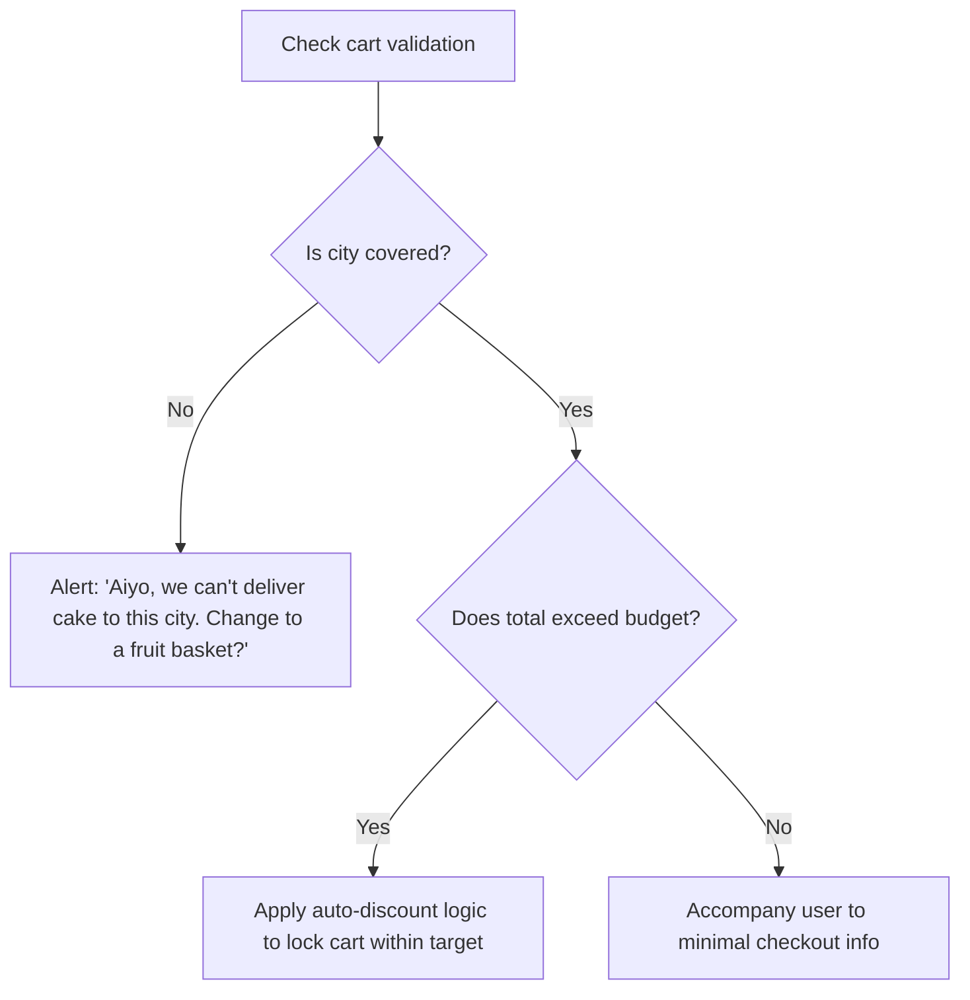

# Nelum: Cart Intelligence & Conversion Optimization System

This design specification outlines the architectural parameters, rules, and mathematical algorithms behind Nelum's **Cart Intelligence, Conversion Optimization, and Autonomous Shopping Flow System**. It governs how Nelum validates card setups, scores packages, coordinates quick checkout paths, manages multilingual greeting templates, and re-engages abandoned baskets.

---

## 1. System Overview & Conversational Pipelines

Nelum replaces traditional e-commerce checklists with an integrated shopping flow:

```
[Target Occasion] ➔ [Cart Quality Score check] ➔ [Dynamic Bundle suggestion] ➔ [Minimal checkout fields] ➔ [Dispatch]
```

---

## Part 1 — Cart Intelligence Engine

The Cart Intelligence Engine calculates a **Cart Quality Index (CQI)** that determines if the user's basket represents a complete, thoughtful gift.

### TypeScript Data Models:

```typescript
export interface CartScore {
  completenessRatio: number; // 0.0 to 1.0
  hasGreetingCard: boolean;
  hasCoreItem: boolean;
  hasAccessoryItem: boolean;
  suggestedAdditions: string[];
}

export class CartIntelligenceEngine {
  public evaluateCart(cart: Cart, occasion: string): CartScore {
    const items = cart.items;
    const hasCard = !!cart.greetingCardMessage;
    const hasCake = items.some(i => i.productId.includes('cake') || i.productId.includes('gateau'));
    const hasFlowers = items.some(i => i.productId.includes('roses') || i.productId.includes('lilies'));
    const hasTeddy = items.some(i => i.productId.includes('teddy'));

    let completeness = 0.3;
    const suggested: string[] = [];

    if (occasion === 'birthday') {
      if (hasCake) completeness += 0.4;
      else suggested.push('Signature Black Forest Gateau');
      
      if (hasCard) completeness += 0.2;
      else suggested.push('Personal Greeting Card');

      if (hasTeddy || hasFlowers) completeness += 0.1;
      else suggested.push('Kids Deluxe Teddy Bear');
    }

    return {
      completenessRatio: Math.min(completeness, 1.0),
      hasGreetingCard: hasCard,
      hasCoreItem: hasCake || hasFlowers,
      hasAccessoryItem: hasTeddy,
      suggestedAdditions: suggested
    };
  }
}
```

---

## Part 2 — Cart Completeness Analyzer

Calculates completeness indices matching relationship expectations:

- **Birthday for Sister**: Require `Cake` + `Printed Greeting Card`.
  - *Suggestion*: *"A birthday cake is empty without candle light. Shall I add a set of birthday candles and card for free? 🌸"*
- **Anniversary for Wife**: Require `Flowers` + `Chocolates` + `Handwritten Message`.
  - *Suggestion*: *"Roses carry beauty, but sweet chocolates make it perfect. 🌹 Shall I add a Chocolates & Joy Luxury Box to your bundle?"*

---

## Part 3 — Smart Bundle Expansion Engine

Suggests additions using an **Acceptance Probability Scoring (APS)** engine.

- **Formula**:

$$P_{\text{accept}} = S_{\text{affinity}} \times C_{\text{budget}} \times E_{\text{urgency}}$$

Where:
- $S_{\text{affinity}}$: Product category pairing index (e.g., Flowers ➔ Chocolates is $0.9$; PlayStation ➔ Flowers is $0.1$).
- $C_{\text{budget}}$: Budget headroom ($1.0$ if under budget, drops to $0.1$ if the addition pushes cart total past budget by $>15\%$).
- $E_{\text{urgency}}$: Urgency factor ($1.2$ for same-day deliveries, $1.0$ for standard timelines).

---

## Part 4 — Conversion Psychology Engine

Nelum incorporates local persuasion templates that rely on social proof and value reinforcement without sounding pressuring.

- **Social Proof Template**: *"Many customer surprises going to Colombo 07 this morning include our fresh Ceylon Tea Selection alongside fruit baskets. Would you like me to include it?"*
- **Convenience Template**: *"I've checked our local bakers; they have fresh Black Forest gateaux ready for dispatch within 3 hours. Shall we lock this in?"*

---

## Part 5 — Autonomous Gifting Workflows

Nelum proactively resolves conflicts (e.g. delivery date/city checks, budget caps) using a decision engine:



---

## Part 6 — Cart Recovery Engine

When a user session stays inactive for $> 8$ minutes, Nelum fires a localized re-engagement WhatsApp/SMS message:

* **Singlish Recovery**: *"Kohomada machan! 😄 I saved the Black Forest cake and red roses in your basket. Same-day delivery slots for Colombo are booking up fast. Ready to send the surprise? 🌸"*
* **Tamil Recovery**: *"Vanakkam! I've preserved your gift selections for Amma. Shall we continue to delivery?"*

---

## Part 7 — Checkout Acceleration Engine (Under 2 Minutes)

Nelum collects variables progressively, utilizing historic cookies and autocomplete data to minimize typing requirements:

```
[Chat Input: 'Checkout'] ➔ [Recall Last Address] ➔ [Prompt Greeting Card text] ➔ [Display Invoice link]
```

- **Minimal Field Rule**: If the customer is a repeat buyer, Nelum recalls the last used sender information and queries only for changes: *"Should we deliver to Priyantha at Flower Road like last time, or use a new address?"*

---

## Part 8 — Multilingual Greeting Card Generator

Nelum compiles personalized messages in English, Sinhala, and Tamil based on occasions:

### Occasion: Anniversary (Romantic)
- **English**: *"To my love, every year with you is a blessing. Happy Anniversary!"*
- **Sinhala (Unicode)**: *"මගේ ආදරණීය බිරිඳට, ඔබ මා ලැබූ උතුම්ම තෑග්ගයි. සුභ සංවත්සරයක් වේවා!"*
- **Tamil**: *"என் அன்பிற்குரியவளுக்கு, இனிய திருமண நாள் வாழ்த்துக்கள்!"*

### Occasion: Apology
- **Tanglish / Singlish**: *"Mage athin una waradata samawenna. I'm sorry my love. Hope this roses make you smile."*

---

## Part 9 — Revenue Optimization Engine

Ethical upselling is capped by mathematical threshold bounds:

```typescript
export function getUpsellRecommendation(cart: Cart, budget: number): Product | null {
  const currentTotal = cart.subtotal;
  const headroom = budget - currentTotal;
  
  if (headroom <= 0) return null; // Already at or past budget target

  // Target up-sell item pricing must not exceed 25% of the total budget
  const upsellMaxPrice = budget * 0.25;
  const match = findBestPairingProduct(cart.items, upsellMaxPrice);
  return match;
}

function findBestPairingProduct(items: CartItem[], maxPrice: number): Product | null {
  // Logic maps to returning tea box or chocolate box based on maxPrice
  return null;
}
```

---

## Part 10 — Conversational Friend Behaviors

Nelum handles sensitive customer situations with deep empathy:

* **Forgotten Birthdays**: *"Aiyo, don't worry! 😄 We all get busy. I have selected our special 'Same Day Express Cake & Flower Bundle'. If we check out now, it will reach Flower Road by 3:00 PM today. Let's get this sorted!"*
* **Corporate Gift Restrictions**: *"Respectful greetings. For corporate clients, our Ceylon Premium Tea Box is standard, high-quality, and professional. I will avoid overly casual wraps or balloons."*

---

## Part 11 — Multilingual Conversion Logic

Nelum normalizes multilingual checkout commands to state selectors:

- *"Mage address ekata yawanna"* ➔ `state = DELIVERY_COLLECTION`
- *"Checkout karanna"* ➔ `state = ORDER_REVIEW`
- *"Tawa mokada tiyenne"* ➔ `state = PRODUCT_SEARCH`

---

## Part 12 — Conversion Telemetry & Dashboard

Nelum registers core metrics to a dashboard repository:

- **Metric**: `cart_creation_rate` (Target: $> 45\%$ of visitor sessions).
- **Metric**: `bundle_acceptance_rate` (Target: $> 22\%$ of recommended upsells).
- **Metric**: `checkout_completion_rate` (Target: $> 82\%$ of cart reviews).

---

## Part 13 — End-to-End Shopping Journeys

### Journey 1: The Apology Surprise Flow
```
User: "Mage wife math ekka tharahawela. I need to send something today."
Nelum: "Aiyo, let's make it right. 🌹 I've loaded fresh lilies and chocolates on the right. Lilies represent peace. Shall I add a card saying sorry?"
User: "Yes please. Add card saying 'Mage waradata samawenna'."
Nelum: "Perfect. Put in cart. Let's arrange same-day delivery to Colombo 07. Ready to send?"
User: "Yes."
Nelum: [Generates checkout invoice page]
```

---

## Part 14 — Competition-Winning Features

### 1. Forgot Anniversary / Emergency Rescue Mode
If the user indicates they forgot an anniversary, Nelum shifts to **Emergency Mode**:
- Filters catalog strictly to items flagged for immediate same-day delivery within 2 hours.
- Bypasses standard shopping grids and redirects user straight to receiver detail screens, keeping all chat inputs prioritized on logistics.
- Automatically selects the nearest local florist and coordinates express dispatch.
