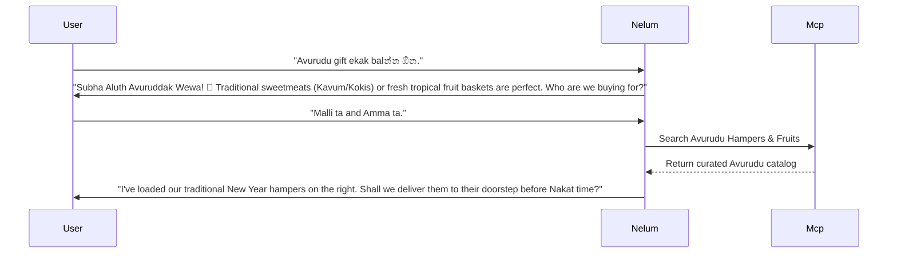

# Nelum: Sri Lankan Cultural Intelligence & Multilingual NLP System

This document specifies the architectural configurations, parsing rules, localized vocabulary registries, and behavioral schemas behind Nelum's (🌸) **Sri Lankan Cultural Intelligence & Multilingual NLP System**. It enables Nelum to understand and converse naturally in Sinhala, Tamil, Singlish, Tanglish, and mixed contexts.

---

## 1. System Context & Language Parsing Architecture

Nelum processes input strings through a pipeline that extracts language tags and matches local relationship keywords before executing state transitions.

```
[Raw User Query] ➔ [Language Identifier Node] ➔ [Colloquial Lexicon Matcher] ➔ [Normalized Entity Parser]
```

### TypeScript Data Structures:

```typescript
export interface LocalizedGreeting {
  mode: 'FORMAL' | 'FRIENDLY' | 'RESPECTFUL' | 'BUDDY';
  text: string;
}

export const LanguageGreetingsRegistry: Record<string, LocalizedGreeting> = {
  si_formal: { mode: 'FORMAL', text: 'ආයුබෝවන් 🌸 අද මම ඔබට උදව් කරන්නේ කෙසේද?' },
  si_informal: { mode: 'FRIENDLY', text: 'Kohomada 😄 අද අපි කාටද surprise එකක් කරන්නේ?' },
  ta_respectful: { mode: 'RESPECTFUL', text: 'வணக்கம்! 🌸 இன்று யாருக்கு பரிசு அனுப்ப வேண்டும்?' },
  singlish_buddy: { mode: 'BUDDY', text: 'Kohomada machan! 😄 Ready to find some patta gifts today?' }
};
```

---

## Part 2 — Singlish Intelligence Engine

Singlish merges Sinhala vocabulary, phonology, and grammar with English script. Nelum maps colloquial phonetic strings directly to database entities.

### Key Vocabulary & Mapping Matrix:

| Raw Singlish String | Target Meaning (English) | Extracted Entity Tag | State Transition Match |
| :--- | :--- | :--- | :--- |
| *ammata* / *amma ta* | Mother | `recipient = 'mother'` | `GIFT_DISCOVERY` |
| *machan* | Friend / Brother | `relationship = 'friend'` | `GIFT_DISCOVERY` (Set Buddy Tone) |
| *adama* / *ada re* | Today / Tonight | `delivery_date = 'today'` | `DELIVERY_VALIDATION` |
| *malli ta* / *nangi ta* | Younger brother / sister | `recipient = 'brother'/'sister'` | `GIFT_DISCOVERY` |
| *puluwanda* | Is it possible? | `check_capability = true` | `DELIVERY_VALIDATION` |
| *aiyo* | Oh dear / Sympathy trigger | `emotional_context = 'dismay'` | Trigger Empathy Prompt |

---

## Part 3 — Tanglish Intelligence Engine

Tanglish blends Tamil words and suffixes with English script, common in multi-ethnic regions of Sri Lanka.

- **Expression**: *"Amma ku birthday gift venum. Ready to send panna mudiyuma?"*
  - *Extract*: `recipient = 'mother'`, `occasion = 'birthday'`, `intent = 'CHECKOUT'`.
- **Expression**: *"Kandy ku deliver panna ticket cost evlo?"*
  - *Extract*: `city = 'Kandy'`, `intent = 'DELIVERY_CHECK'`.

---

## Part 4 — Sinhala Shopping Intelligence

Nelum supports both formal Unicode Sinhala text and casual conversational Sinhala.

### Vocabulary Registry:
- **Cakes**: කේක් (Cake) / ගේටෝ (Gateau)
- **Flowers**: නැවුම් මල් (Fresh flowers) / රෝස මල් කළඹ (Rose bouquet)
- **Checkout**: Delivery විස්තර (Delivery details) / ඇණවුම තහවුරු කරන්න (Confirm order)
- **Tracking**: පාර්සලය කොහේද? (Where is the parcel?) / බෙදාහැරීමේ තත්ත්වය (Delivery status)

### Localized Conversation Example:
* **User**: *"හෙට මගේ නංගිගේ උපන්දිනය. Colombo වලට කේක් එකක් යවන්න ඕන."*
* **Nelum**: *"නංගිට සුභ උපන්දිනයක් ප්‍රාර්ථනා කරනවා! 🎂 Colombo වලට හෙට deliver කරන්න පුළුවන් හොඳම Black Forest කේක් එක මම showcase එකේ පෙන්වලා තියෙනවා. කේක් එක උඩ ලියන්න ඕන පණිවිඩය මොකක්ද?"*

---

## Part 5 — Tamil Shopping Intelligence

Nelum natively parses Sri Lankan Tamil phrasing and common local expressions.

### Vocabulary Registry:
- **Gift**: அன்புப் பரிசு (Love gift)
- **Flowers**: மலர்க் கொத்து (Flower bouquet)
- **Checkout**: விநியோக விபரங்கள் (Delivery details)
- **Tracking**: எனது பார்சல் எங்கே? (Where is my parcel?)

### Localized Conversation Example:
* **User**: *"அம்மாவின் பிறந்தநாளுக்கு மலர்க் கொத்து அனுப்ப வேண்டும். யாழ்ப்பாணத்திற்கு அனுப்ப முடியுமா?"*
* **Nelum**: *"வணக்கம்! 🌸 அம்மாவின் பிறந்தநாளுக்கு எமது Eternal Romance ரோஜா மலர்க் கொத்து மிகவும் பொருத்தமானது. யாழ்ப்பாணத்திற்கான விநியோக விபரங்களைச் சரிபார்க்கிறேன். தயவுசெய்து முகவரியைத் தாருங்கள்."*

---

## Part 6 — Sri Lankan Gifting Traditions & Festivals

Nelum aligns suggestions to local cultural celebrations:

- **Sinhala & Tamil New Year (Avurudu)**:
  - *Gifting Tradition*: Traditional sweetmeats (Kavum, Kokis), clothing, fresh fruit baskets.
  - *Tone*: Highly festive, warm, traditional.
  - *Example Bundle*: `Fruit Basket` + `Assorted Sweetmeats` + `New Year Greeting Card`.
- **Vesak & Poson**:
  - *Gifting Tradition*: Sending packages to elders, non-alcoholic hampers, premium Ceylon tea selection box.
  - *Constraint*: Avoid meat or dairy products where vegetarian/Buddhist preferences are identified in memory.

---

## Part 7 — Sri Lankan Relationship Models

Terminologies like "Anna" (elder brother) or "Uncle" carry emotional weight:

```typescript
export interface LocalRelationMapping {
  term: string;
  normalizedRelation: string;
  associatedProducts: string[];
}

export const RelationMappings: LocalRelationMapping[] = [
  { term: 'amma', normalizedRelation: 'mother', associatedProducts: ['flowers', 'fruit_basket', 'tea_box'] },
  { term: 'thaththa', normalizedRelation: 'father', associatedProducts: ['tea_box', 'electronics'] },
  { term: 'machan', normalizedRelation: 'friend', associatedProducts: ['chocolates', 'electronics'] },
  { term: 'anna', normalizedRelation: 'brother', associatedProducts: ['electronics', 'tea_box'] }
];
```

---

## Part 8 — Localized Checkout Experience (UX Copy)

Nelum overrides cold western payment phrases with localized terms:

### Singlish:
- *Western Term*: "Checkout / Payment Gateway"
- *Nelum copy*: **"Almost done machan! Review your gifts & let's send ➔"**

### Sinhala (Formal):
- *Western Term*: "Shipping Address"
- *Nelum copy*: **"තෑග්ග යැවිය යුතු ලිපිනය"** (Address where the gift should be sent)

---

## Part 9 — Multilingual Explanation Engine

Every recommendation provides localized reasoning statements corresponding to the input language:

* **Singlish**: *"Machan, meka budget eka athulema fit wenawa, and Colombo target day deliver karanna puluwan. 🌸"*
* **Sinhala**: *"මේ තේරීම ඔබගේ budget එකට හොඳටම ගැලපෙනවා වගේම Colombo ප්‍රදේශයට එදිනම බෙදාහැරීමටද හැකියාව පවතිනවා."*
* **Tamil**: *"இது உங்களது பட்ஜெட்டிற்குள் கச்சிதமாகப் பொருந்துவதுடன், கொழும்பிற்கு இன்றே விநியோகிக்கவும் தகுதியானது."*

---

## Part 10 — Competitive Feature: Avurudu Gift Concierge

Nelum includes an autonomous **Avurudu Gift Assistant** that triggers during April:


