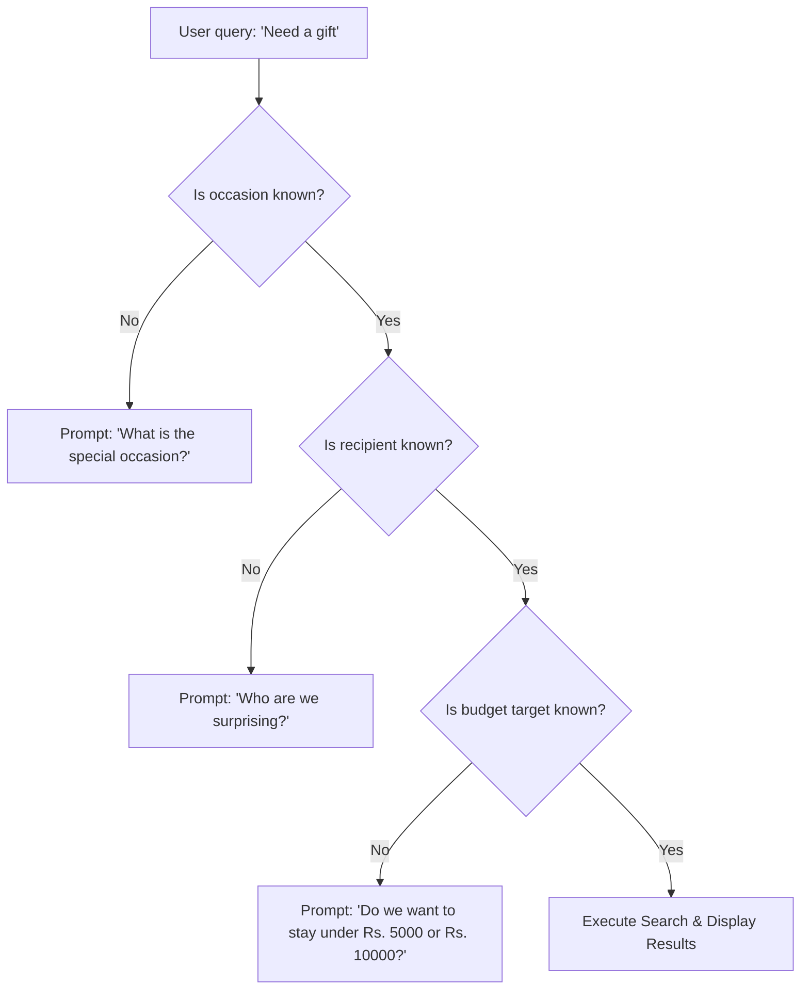
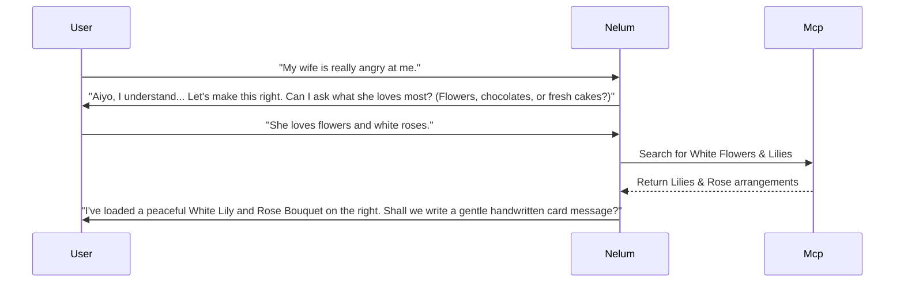

# Nelum: Decision Intelligence & Personalization System

This document specifies the architecture, scoring models, and behavioral logic behind Nelum's **Decision Intelligence System**. It defines how Nelum acts as an empathetic personal shopping companion by mapping relationships, analyzing budgets, compiling dynamic gift packages, and composing natural text explanations.

---

## 1. Decision Intelligence Architecture

Nelum's recommendations are processed through a pipeline of contextual analyzers and scoring filters.

```
                    ┌────────────────────────────────────────┐
                    │               USER QUERY               │
                    └───────────────────┬────────────────────┘
                                        │
             ┌──────────────────────────┼──────────────────────────┐
             ▼                          ▼                          ▼
    [Occasion Analyzer]      [Relationship Analyzer]      [Emotional Analyzer]
  ┌─────────────────────┐    ┌─────────────────────┐    ┌─────────────────────┐
  │ Ex: Birthday, Vesak │    │ Ex: Amma, Manager   │    │ Ex: Sorry, Urgency  │
  └──────────┬──────────┘    └──────────┬──────────┘    └──────────┬──────────┘
             │                          │                          │
             └──────────────────────────┼──────────────────────────┘
                                        │
                                        ▼
                            [Budget Engine Optimizer]
                                        │
                                        ▼
                            [Product Scoring Matrix]
                                        │
                                        ▼
                            [Final Ranked Showcase]
```

### TypeScript Data Contracts:

```typescript
export interface DecisionContext {
  occasion: string;
  relationship: string;
  emotionalState: 'SORRY' | 'ROMANTIC' | 'CELEBRATORY' | 'GRATEFUL' | 'SUPPORTIVE' | 'SURPRISE';
  urgencyLevel: 'LOW' | 'MEDIUM' | 'HIGH';
  budgetTarget: number;
  deliveryCity: string;
  userLanguageCode: 'en' | 'si' | 'ta' | 'mix';
  personalPreferences: {
    avoidCategories: string[];
    preferredColorTheme?: string;
  };
}

export interface DecisionStrategy {
  targetCategoryWeights: Record<string, number>;
  bundleTemplateName: string;
  recommendedPriceCeiling: number;
  conversationalWarmthLevel: 1 | 2 | 3 | 4;
}
```

---

## Part 2 — Occasion Intelligence Engine

Nelum maps events to distinct cultural expectations, budgets, and delivery restrictions in the Sri Lankan context.

| Occasion | Emotional Goal | Target Categories | Average Budget (LKR) | Default Bundle Template | Delivery Sensitivity |
| :--- | :--- | :--- | :--- | :--- | :--- |
| **`Birthday`** | Joyous celebration | Cakes, Flowers, Toys | 6,500 | `Cake` + `Roses` + `Teddy` | **HIGH** (Time critical) |
| **`Anniversary`**| Romantic milestone | Red Flowers, Chocolates | 12,000 | `Red Roses` + `Chocolates` + `Card`| **MEDIUM** |
| **`Apology`** | Resolution & Empathy| White Lilies, Hampers | 8,000 | `Lilies` + `Chocolates` + `Apology Card`| **HIGH** |
| **`New Baby`** | Comfort & Joy | Toys, Fresh Fruit, Hampers| 5,500 | `Teddy` + `Fruit Basket` + `Message` | **LOW** |
| **`Vesak`** | Peace & Respect | Ceylon Tea, Fruits | 5,000 | `Tea Selection` + `Fruit Basket` | **LOW** |
| **`New Year`** | Prosperity & Family| Groceries, Cakes, Tea | 9,000 | `Grocery Hamper` + `Traditional Cake`| **HIGH** (Nakat times) |

---

## Part 3 — Relationship Intelligence Engine

Understanding relationship weights prevents contextually awkward suggestions (e.g. recommending a romantic teddy bear to a business partner).

```typescript
export interface RelationshipProfile {
  relation: string;
  emotionalWeight: number; // 0.0 to 1.0
  expectedBudgetRange: [number, number];
  preferredCategories: string[];
  toneRestriction: 'PROFESSIONAL' | 'WARM' | 'INFORMAL';
}

export const RelationshipRegistry: Record<string, RelationshipProfile> = {
  wife: {
    relation: 'wife',
    emotionalWeight: 0.95,
    expectedBudgetRange: [8000, 25000],
    preferredCategories: ['flowers', 'chocolates', 'cakes'],
    toneRestriction: 'WARM'
  },
  amma: {
    relation: 'mother',
    emotionalWeight: 0.98,
    expectedBudgetRange: [5000, 15000],
    preferredCategories: ['flowers', 'groceries', 'tea_box'],
    toneRestriction: 'WARM'
  },
  manager: {
    relation: 'manager',
    emotionalWeight: 0.20,
    expectedBudgetRange: [4000, 8000],
    preferredCategories: ['groceries', 'tea_box'],
    toneRestriction: 'PROFESSIONAL'
  }
};
```

---

## Part 4 — Emotional Shopping Engine

Nelum analyzes input words to adapt response warmth, bundle priorities, and warning dialogs.

- **Apology Signal**: User types *"wife is mad"*, *"sorry"*, *"make up for it"*.
  - *Strategy*: Set warmth to **High**. Recommend tranquil white lilies instead of bright yellow decorations. Offer complimentary handwritten card text options.
- **Urgency Signal**: User types *"today itself"*, *"forgot birthday"*, *"needs to reach within 2 hours"*.
  - *Strategy*: Automatically query the MCP catalog for same-day items available for Colombo shipping. Override standard delivery date selectors.

---

## Part 5 — Budget Intelligence Engine

The budget optimization engine ranks candidate products and scales suggestions to keep within limits:

```
                  ┌────────────────────────────────────────┐
                  │          USER BUDGET INPUT             │
                  └───────────────────┬────────────────────┘
                                      │
              ┌───────────────────────┴───────────────────────┐
              ▼                                               ▼
     [Target Range Fit]                             [Smart Upsell check]
If price <= target: Score = 1.0                 If target exceeded by < 15%:
If price > target: Exponential Decay             Apply package bundle discount.
```

- **Scoring Function**:

$$Score_{budget} = \begin{cases} 1.0 & \text{if } P_i \le B \\ e^{-\frac{P_i - B}{k}} & \text{if } P_i > B \end{cases}$$

Where $P_i$ is product price, $B$ is user budget target, and $k$ is a scaling decay factor (default: $5000$ LKR).

---

## Part 6 — Multi-Factor Product Scoring

The engine compiles catalog candidates, applies weight factors based on state, and outputs a final confidence score:

$$\text{FinalScore}_i = (w_{occ} \cdot \text{Occ}_i) + (w_{rel} \cdot \text{Rel}_i) + (w_{bdg} \cdot \text{Bdg}_i) + (w_{pop} \cdot \text{Pop}_i) + (w_{del} \cdot \text{Del}_i)$$

- **Weight Allocation Parameters**:

```typescript
export interface ScoringWeights {
  wOcc: number; // Occasion compliance weight
  wRel: number; // Relationship fit weight
  wBdg: number; // Budget compliance weight
  wPop: number; // Popularity rating weight
  wDel: number; // Delivery location/date check weight
}

export const StateWeights: Record<string, ScoringWeights> = {
  GIFT_DISCOVERY: { wOcc: 0.35, wRel: 0.25, wBdg: 0.25, wPop: 0.15, wDel: 0.00 },
  DELIVERY_VALIDATION: { wOcc: 0.10, wRel: 0.10, wBdg: 0.20, wPop: 0.10, wDel: 0.50 }
};
```

---

## Part 7 — Bundle Intelligence System

Dynamic bundle assemblies are managed via strict matching tables:

```typescript
export interface BundleTemplate {
  name: string;
  baseCategory: string;
  additions: string[];
  baseBudgetLkr: number;
}

export const BundleTemplates: BundleTemplate[] = [
  {
    name: 'Romantic Surprise',
    baseCategory: 'flowers',
    additions: ['chocolates', 'teddy'],
    baseBudgetLkr: 12000
  },
  {
    name: 'Sympathy Pack',
    baseCategory: 'flowers',
    additions: ['tea_box'],
    baseBudgetLkr: 8500
  }
];
```

---

## Part 8 — Guided Shopping Decision Tree

Nelum resolves parameters progressively. If mandatory details are missing, it schedules disambiguation trees:



---

## Part 9 — Smart Upsell Engine

Upsell suggestions are triggered only when confidence thresholds are met (e.g. adding candles to cakes, or greeting cards to flower orders).

- **Rule**: If `Cart` contains `Cake` and `State == CART_BUILDING`, trigger prompt: *"Would you like me to write a custom message on the cake, or add a beautiful handwritten card for free? 🌸"*
- **Rule**: If `Subtotal` is within $10\%$ of target budget, offer a chocolate box bundle upgrade with a $5\%$ discount.

---

## Part 10 — Memory-Driven Personalization

Nelum leverages user historical logs to tailor its landing page starters:

- **Past Order**: User bought a cake on June 20, 2025, for "Amma".
- **Trigger Date**: June 10, 2026.
- **Action**: Adapt landing hero message to: *"Ayubowan! 🌸 Amma's birthday is coming up soon. Should I help you schedule a fresh cake and flower surprise like last year?"*

---

## Part 11 — Recommendation Explanation Engine

Every product or bundle returned displays a structured list of bullet points detailing the matching logic:

```markdown
### 🌸 Eternal Romance Red Rose Bouquet
- **Price**: Rs. 6,500
- **Why Nelum recommends this**:
  - **Budget Check**: Fits comfortably within your Rs. 10,000 limit.
  - **Occasion Fit**: Red roses are the absolute top choice for anniversaries.
  - **Delivery Availability**: We can deliver this fresh to Colombo 07 today.
```

---

## Part 12 — Multilingual Entity Translation

The language parser maps colloquial Sri Lankan expressions to core semantic entities:

- *"Mage wife ta"* ➔ `extractedEntities.recipient = 'wife'`
- *"අම්මට තෑග්ගක්"* ➔ `extractedEntities.recipient = 'mother'`
- *"Anniversary ekata"* ➔ `extractedEntities.occasion = 'anniversary'`
- *"Adama yawanna puluwanda"* ➔ `extractedEntities.delivery_date = 'today'`

---

## Part 13 — Recommendation APIs (Express / Zod)

```typescript
import { Router } from 'express';
import { z } from 'zod';

const recommendRouter = Router();

recommendRouter.post('/recommend', async (req, res) => {
  const schema = z.object({
    recipient: z.string(),
    occasion: z.string(),
    budget: z.number().positive(),
    city: z.string()
  });

  const parsed = schema.safeParse(req.body);
  if (!parsed.success) return res.status(400).json({ error: parsed.error.format() });

  // Scoring engine computation logic...
  return res.status(200).json({ rankedProducts: [] });
});

export { recommendRouter };
```

---

## Part 14 — Evaluation Framework KPIs

- **Upsell Acceptance Rate (UAR)**: Target $> 18\%$ of orders.
- **Goal Completion Efficiency (GCE)**: Average conversational turns to checkout target $< 5$ messages.
- **Conversational Accuracy**: Intent classification match threshold $> 94\%$.

---

## Part 15 — Competitive Advantage: Apology Assistant Mode

Nelum includes a unique **Apology Assistant Mode** specifically built to handle apologies thoughtfully:


