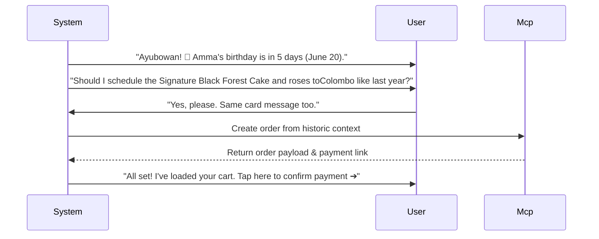

# Nelum: Reordering Intelligence & Customer Memory Engine

This design specification details the database architectures, scoring algorithms, predictive purchase indicators, and conversational reordering flows behind Nelum's (🌸) **Reordering Intelligence, Habit Learning, and Customer Memory System**.

---

## 1. System Context & Memory Processing Pipeline

Nelum aggregates session context and historical purchase data to train user profiles and issue predictive prompts.

```
[Historical Transactions] ➔ [Habit Classifier Engine] ➔ [Long-Term Vector Profile] ➔ [Predictive Gifting Prompts]
```

---

## Part 1 — Customer Memory Architecture

Historical context is compiled into structured Postgres schemas to support fast retrieval.

### TypeScript Data Schemas:

```typescript
export interface RecipientProfile {
  recipientId: string;
  name: string;
  relationship: 'mother' | 'father' | 'wife' | 'husband' | 'friend' | 'manager' | 'sibling' | 'child';
  birthday?: string; // ISO Date String (MM-DD)
  deliveryAddress: string;
  favoriteCategories: string[];
  lastGiftPurchased: { productId: string; date: string } | null;
}

export interface CustomerMemoryProfile {
  customerId: string;
  languagePreference: 'en' | 'si' | 'ta' | 'mix';
  budgetTier: 'BUDGET' | 'MID' | 'PREMIUM';
  preferredDeliveryCity: string;
  frequentRecipients: RecipientProfile[];
  purchaseIntervalDays: number;
}
```

---

## Part 2 — Reordering Engine

Nelum reconstructs active baskets for repeat orders, ensuring stock limits and delivery timelines are validated.

- **Reorder Scoring Model**:
  Calculates the probability that a customer wants to repeat a purchase based on the elapsed time since their last order.

$$P_{\text{reorder}} = e^{-\frac{|t - T_{\text{avg}}|}{\sigma}}$$

Where:
- $t$: Days elapsed since the last order.
- $T_{\text{avg}}$: Average purchase interval calculated from historic profile logs.
- $\sigma$: Standard deviation of customer purchase frequencies (default: $7$ days).

---

## Part 3 — Habit Learning System

Nelum updates user affinity values upon each checkout.

```typescript
export class HabitLearningFramework {
  public updateAffinity(currentPreferences: ShoppingPreferences, newPurchaseCategory: string): ShoppingPreferences {
    const decayFactor = 0.85; // Prioritize recent choices over old habits
    const categoryWeights = currentPreferences.favoriteCategories.reduce((acc, cat) => {
      acc.set(cat, 0.5 * decayFactor);
      return acc;
    }, new Map<string, number>());

    const existingWeight = categoryWeights.get(newPurchaseCategory) || 0;
    categoryWeights.set(newPurchaseCategory, existingWeight + 0.5);

    // Keep top 3 categories
    const sorted = [...categoryWeights.entries()]
      .sort((a, b) => b[1] - a[1])
      .slice(0, 3)
      .map(entry => entry[0]);

    currentPreferences.favoriteCategories = sorted;
    return currentPreferences;
  }
}
```

---

## Part 4 — Occasion Memory Reminder System

The Reminder Service calculates upcoming anniversaries and birthdays.

```
┌─────────────────────────────────┬───────────────────┬──────────────────────────────────┐
│ DATE EVALUATION                 │ STATE TRIGGER     │ PROMPT ACTION                    │
├─────────────────────────────────┼───────────────────┼──────────────────────────────────┤
│ Date == Anniversary - 7 Days    │ `WELCOME`         │ Suggest Golden Anniversary Bundle│
│ Date == Amma Birthday - 5 Days  │ `GIFT_DISCOVERY`  │ Suggest Black Forest Gateau       │
└─────────────────────────────────┴───────────────────┴──────────────────────────────────┘
```

- **Reminder Strategy**: If the current system time is within 7 days of a saved recipient anniversary, Nelum automatically changes its default landing hero starter chips to highlight the upcoming recipient: *"🎂 Surprise Amma"* instead of generic options.

---

## Part 5 — Predictive Shopping Models

Nelum calculates purchase prediction confidence score ($C_{\text{predict}}$) for upcoming cultural events:

$$C_{\text{predict}} = (w_{hist} \cdot H) + (w_{time} \cdot T)$$

Where:
- $H \in \{0, 1\}$: $1.0$ if the user purchased items during the same festival (e.g. Vesak, Christmas) last year, $0.0$ otherwise.
- $T \in [0, 1]$: Proximity factor (increases exponentially as the festival approaches).
- $w_{hist} = 0.70$ and $w_{time} = 0.30$.

---

## Part 6 — Customer Lifecycle Framework

Nelum adjusts conversational mechanics depending on user retention flags:

- **First-Time Buyer**: Focused on trust building, payment assurances, and explaining logistics coverage boundaries.
- **Loyal Customer**: Focused on acceleration, auto-completing addresses, and recommending custom upsells.

---

## Part 7 — Competition-Winning Feature: Birthday Reminder Concierge

Nelum includes an autonomous **Birthday Reminder Concierge** that triggers when a recipient birthday approaches:


